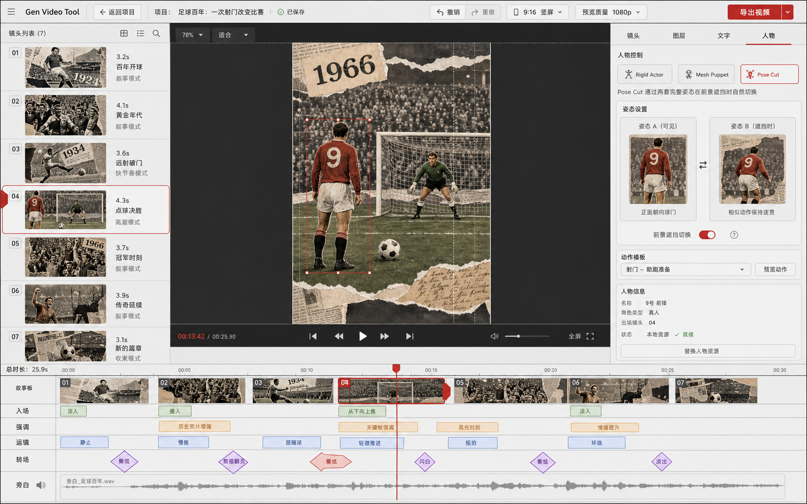
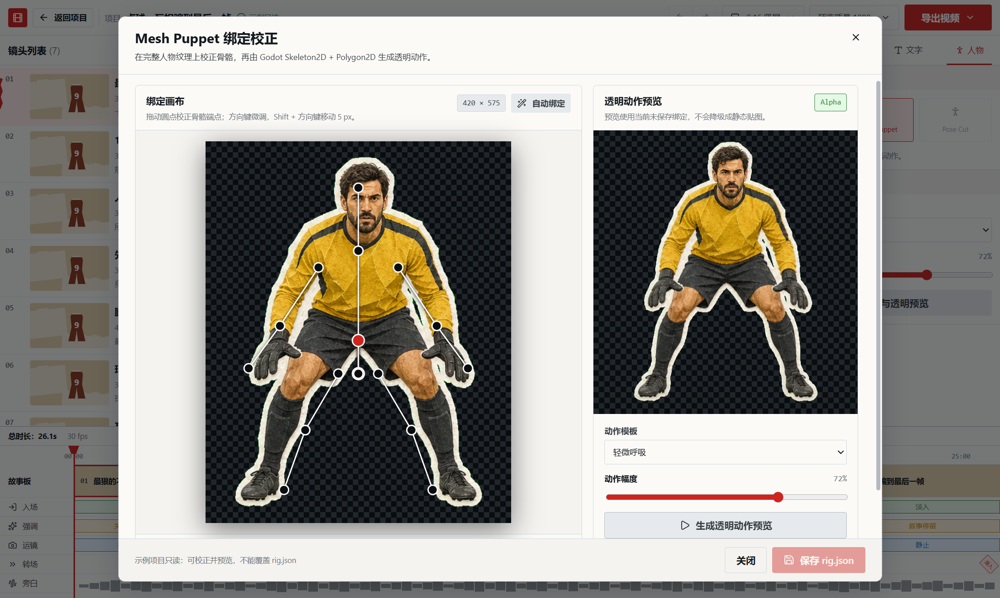

# Gen Video Tool

本地优先的纸片动画视频生产工具。它把 ChatGPT/Imagegen 交付的结构化素材包变成可检查、可编辑、可重复渲染的 MP4，不把日常生产绑定在 Codex、Fal 或付费 I2V 上。



## 实际效果



- [足球 Mesh Puppet 成片演示（MP4，含旁白、无 BGM、无烧录字幕）](docs/media/football-mesh-puppet-demo.mp4)
- [守门员透明人物动作演示（VP9 Alpha WebM）](docs/media/mesh-puppet-alpha-preview.webm)

## 已实现

- Electron + React 桌面工作台：首页、安全导入检查、三栏编辑器、故事节拍时间线和真实导出进度。
- ZIP/目录导入门禁：路径穿越、绝对路径、大小写/Unicode 冲突、符号链接、ZIP bomb、重复 ID、丢失引用、图像/Alpha、音频和 SRT 检查。
- 三种人物协议：Rigid Actor、Godot Mesh Puppet、Pose Cut 完整人物姿态切换。
- 8 个确定性 Motion Recipes；背景、主体、道具、前景按深度独立视差，标题保持低/零视差。
- 编辑器预览与最终渲染共用 Remotion 运动求值器。
- 本地 Remotion + FFmpeg：H.264 MP4、旁白混合、独立 SRT、起/中/末抽帧 QA；默认无 BGM、无烧录字幕。
- 本地 Godot Worker：读取完整人物 PNG 与 `rig.json`，构建 `Skeleton2D + Bone2D + Polygon2D` 连续网格，加载动作模板并输出透明 PNG 序列、VP9 Alpha WebM 或 ProRes 4444 MOV。
- Electron Mesh Puppet 校正台：完整人物纹理上的双端骨骼拖拽、方向键微调、当前未保存绑定的透明动作预览、只读提示与 `rig.json` 回写。
- Phase 4 首版：Alpha 轮廓启发式自动绑定、可选 RIFE 帧插值 Worker、批量导出报告、本地模板目录与安装。
- 镜头门禁把“镜头语言 + 世界知识 + 物理/流程逻辑”写进结构化数据；足球示例保证球在触球前静止、球离脚后门将才启动。
- 足球与安静故事两套可验证、可渲染示例。
- 可安装技能：[`compose-paper-video`](skills/compose-paper-video/SKILL.md)。

## 快速开始

要求 Node.js 22+、npm、Chrome 或 Edge。首次安装 Electron/Remotion 组件需要联网。

```bash
npm install
npm run typecheck
npm run test
npm run validate:examples
npm run dev
```

只调试 React 渲染层：

```bash
npm run dev:renderer
```

## 验收渲染

```bash
npm run render:football
npm run render:story
npm run render:mesh-preview
npm run render:mesh-webm
npm run render:batch -- quiet-story football-history
npm run qa:frames
```

产物：

```text
output/football/final.mp4
output/football/subtitles.srt
output/football/qa-frames/*
output/story/final.mp4
output/story/subtitles.srt
output/story/qa-frames/*
```

`subtitles.srt` 是外挂文件，不会烧录进视频；`final.mp4` 只混合旁白，不添加背景音乐。

## 素材包

```text
asset-pack/
├── manifest.json
├── narration.txt
├── subtitles.srt
├── audio/narration.wav
├── assets/backgrounds/
├── assets/characters/
├── assets/props/
└── shots/<shot-id>/shot.json
```

生成资产前必须为每个镜头声明：相机位置、人物朝向、动作轴、目标/接触点、支撑与地面、深度顺序、遮挡物和起止状态。完整生产规范在 [`chatgpt-asset-director`](chatgpt-asset-director/INSTRUCTIONS.md)。

## 人物动画边界

- `Rigid Actor`：完整人物整体位移、缩放、轻微旋转和一次性入场。
- `Pose Cut`：两张或更多完整人物姿态；仅在硬切、纸片/道具全遮挡、闪帧、撕纸或切镜下切换，永不交叉淡化。
- `Mesh Puppet`：连续完整纹理 + 隐藏连续网格 + `Skeleton2D` 骨骼。编辑器可自动生成首版绑定、人工校正并直接调用 Godot 生成透明预览；最终导出会先逐帧生成透明人物序列，缺失 Worker 结果时明确失败，不会退化成静态贴图。

禁止拆肢、幻肢式关节、人物 flip/fold、默认循环 bob、整张海报同平面运镜。

## 架构

```text
apps/desktop              Electron 主进程、受限 preload、React 编辑器
packages/schema           schema v2 与迁移
packages/asset-pack       安全导入、媒体检查、项目读写
packages/motion-core      8 个动作配方、事件编译、独立图层视差
packages/remotion-engine  共享预览/导出的画面求值器
packages/render-service   Remotion 渲染、旁白混合、外挂 SRT、QA
packages/worker-client    Godot、自动绑定与 RIFE 本地 worker 客户端
packages/template-market  模板目录校验与本地安装
motion-worker             Godot Mesh Puppet Worker 与动作模板
templates                 可安装的动作、镜头与世界规则模板
chatgpt-asset-director    ChatGPT/Imagegen 素材生产契约
skills                    可安装的 Codex 技能
examples                  足球与故事资产包
```

更详细的信任边界和数据流见 [`docs/ARCHITECTURE.md`](docs/ARCHITECTURE.md)。

## 安全与本地性

- Renderer 无 Node 权限，只能通过窄 IPC 调用。
- 文件选择后使用一次性句柄；Renderer 不能提交任意路径给导入器。
- 导入先进入 staging，通过全部阻断项后原子提交。
- 本地素材通过 `gen-video-asset://` 受限协议读取，并执行根目录包含检查。
- 删除仅允许应用项目根目录下的非只读项目。

## License

MIT
