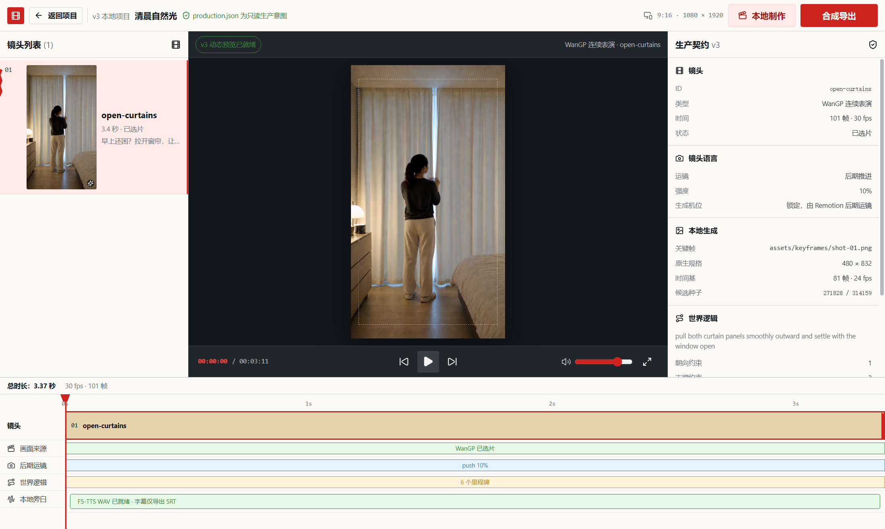

# Gen Video Tool

Gen Video Tool 是一套全新的、本地优先的视频生产桌面工具。ChatGPT/Imagegen 负责可移植的源资产包，本机 WanGP 负责连续人物与环境表演，Remotion 负责确定性道具、遮挡、统一运镜和交付合成，F5-TTS 负责本地旁白，FFmpeg 负责媒体规范化与抽帧验收。

项目从 v3 契约起步，不读取旧 manifest、分镜 JSON 或 v2 项目，也不提供迁移兼容层。产品原则见 [`docs/CONTINUITY_CHARTER.md`](docs/CONTINUITY_CHARTER.md)：镜头必须是连续世界，方向先于生成，物理是门禁，模型生成表演底片，编辑器拥有最终影片。

## 当前进度

状态以 2026-07-17 的本地证据为准。

| 能力 | 当前状态 | 已验证边界 |
| --- | --- | --- |
| v3 项目契约 | 已实现并有测试 | 单一 `production.json`；源资产和 `generated/` 严格分离；没有 v2 回退 |
| v3 资产包导入 | 已实现并有测试 | 目录/ZIP、安全路径、读取前体积上限、流式解压/CRC、图片与音频探测、引用完整性、原子提交；源包禁止携带 `generated/` |
| WanGP MCP | 真实本地生成已验证 | 通过官方 MCP stdio 调用本机 Fun InP 1.3B，已得到真实 480×832、24 fps、81 帧视频；MCP Streamable HTTP 传输也已实现 |
| 双候选与持久状态 | 已实现并有测试 | 两枚固定 seed 串行生成；严格帧数 QA 与人工选择分离；取消有截止时间；导出前重验视频/Matte 哈希和媒体探测 |
| F5-TTS | 真实本地 WAV 已验证 | 参考音频克隆、分段合成、合并、时长检查和外挂 SRT；v3 项目必须先选定视频才能生成旁白 |
| Electron 工作流 | 已完成真实端到端验收 | 导入 → 生成 → 审片 → F5-TTS → 动态预览 → 导出；真实桌面导出得到 MP4、SRT 与 20 张 QA 抽帧 |
| Web Skill → ZIP → 桌面 | 已完成真实回合验收 | 新样片目录经 Skill 校验零警告，确定性组装 ZIP，再由桌面同款导入器检查、原子导入并打开 `offline-only` v3 项目；源图和参考 WAV 哈希保持一致 |
| 新 v3 样片 | 已完成并通过验收 | [`examples/morning-light-v3`](examples/morning-light-v3/README.md) 与 23.57 秒的 [`examples/cat-noodle-stall-v3`](examples/cat-noodle-stall-v3/README.md) 均已完成双候选、人工拒绝/选择、F5-TTS、Remotion/FFmpeg 交付与抽帧检查 |

## 已验证样片



- [查看最终 MP4](docs/media/morning-light-v3.mp4)
- [查看 20 帧 QA 联系表](docs/media/morning-light-v3-contact-sheet.jpg)
- 成片：1080×1920、30 fps、精确 101 帧、H.264/yuv420p/bt709、AAC 48 kHz 单声道；无 BGM、无烧录字幕；
- 接受候选：seed `314159`，SHA-256 `f9a3d0ac9389cc049d6bb24ef744a2c4824f967022f51c2e7193cb52eb9ea30b`；
- F5-TTS WAV：SHA-256 `033f1304c562a022cdc8f1fa212a90052a52663e497f206d898c64af3c270013`；
- 最终 MP4：SHA-256 `1956bda567f171010446c5d161ffe2cfc64de046c1c3f48a3a557f20fbefc987`。

### 23.57 秒实操样片：橘猫夜市炒粉

- [查看最终 MP4](docs/media/cat-noodle-stall-v3.mp4)
- [下载外挂 SRT](docs/media/cat-noodle-stall-v3.srt)
- [查看 72 点 QA 联系表](docs/media/cat-noodle-stall-v3-contact-sheet.jpg)
- 七个连续镜头：开摊、热锅、倒粉、翻炒、淋酱、颠锅、出餐；每个镜头由本地 WanGP 生成两枚候选，人工按角色完整性、道具接触和物理落点选片；
- 成片：23.5667 秒、1080×1920、30 fps、精确 707 帧、H.264/yuv420p、AAC 48 kHz 单声道；F5-TTS 旁白，无 BGM、无烧录字幕；
- 最终 MP4：SHA-256 `2fcbbb0ec9d1eb9eb9ada4520ab13af1547862137b3ea58d0deff4f27d3db707`。

仓库提交便携源资产包和经过验收的轻量演示媒体，不提交本机模型缓存、原始候选或工作状态。完整候选、人工审片记录、F5 缓存和交付副本保留在桌面应用数据目录。

## 桌面工作流

```text
1. 导入资产
   production.json + 完整首/尾关键帧 + 透明道具/遮挡 + F5 参考音频

2. 本地生成
   自动探测 WanGP/GPU/模型 -> 两个固定 seed 串行生成 -> 技术 QA

3. 人工审片
   检查身份、解剖、方向、支撑、接触时序和镜头稳定性 -> 选择一个候选

4. 交付
   F5-TTS 旁白 -> Remotion 确定性合成 -> FFmpeg 检查 -> MP4 + 外挂 SRT
```

没有通过技术 QA 的候选不能选择；没有人工选择的视频镜头不能合成旁白或导出。缺少模型、候选、遮挡或旁白时会明确失败，不会用静态图片冒充生成成功。

交付规则是固定产品约束：

- 1080×1920、30 fps、H.264、yuv420p；
- 旁白来自本地 F5-TTS，最终复用为 AAC 音轨；
- 字幕只输出独立 `.srt`，不烧录进视频；
- `bgm` 必须为 `null`，不自动添加背景音乐；
- 人物连续动作来自真实视频模型；图形图层只承担标题、图表、道具和明确的静态拼贴镜头。

## v3 项目目录

源资产包是可审计、可复制的只读输入：

```text
my-project/
├── production.json               # 唯一项目入口和生产契约
└── assets/
    ├── keyframes/                # 完整人物/场景首帧与可选尾帧
    ├── props/                    # 透明确定性道具
    ├── mattes/                   # 可选局部遮挡素材
    └── voice-reference.wav       # F5-TTS 参考音频
```

桌面端成功导入后才创建可变产物：

```text
generated/
├── production-state.json         # 任务、候选、QA、选择与旁白状态
├── provider/                     # WanGP 任务、ASCII staging 与原始输出
├── video/                        # 规范化候选视频
├── review-history/               # 被拒绝尝试与人工审片证据
├── audio/                        # F5-TTS 分段与合并旁白
├── cache/                        # 项目隔离的本地运行缓存
└── final/                        # 最终 MP4 与外挂 SRT
```

源资产包中出现 `generated/` 会被拒绝，避免把旧候选或伪造完成状态带到另一台电脑。

## 本地运行

要求 Node.js 22.12+、npm、FFmpeg，以及可选的本地 WanGP 与 F5-TTS 环境。

```bash
npm install
npm run build:desktop
npm run dev
```

Windows 本地工作区也可以直接启动或重新生成桌面快捷方式：

```powershell
npm run desktop:launch
npm run desktop:shortcut
```

快捷方式只指向根目录唯一的 `out/` 构建，不再使用 `apps/desktop/out/` 的旧构建副本。
若窗口启动失败，先关闭旧的 Gen Video Tool 实例并重新执行构建；可审计诊断位于 `.desktop-data/logs/desktop.log`（打包版位于 Electron `userData/logs/`）。

### WanGP

推荐让工具直接启动官方 WanGP MCP stdio 进程：

```powershell
$env:WANGP_ROOT = 'D:\AI\WanGP'                    # 改为你的绝对路径
$env:WANGP_PYTHON = 'D:\AI\WanGP\env_conda\python.exe'
$env:WANGP_CACHE_ROOT = 'D:\AI\model-cache\wangp'
npm run local:production:detect -- examples/morning-light-v3
```

未设置 `WANGP_ROOT` 时，工具会检查仓库相邻目录、当前磁盘根目录、用户目录和 LocalAppData；公共代码不绑定某台机器的盘符。

也可以连接用户自行启动的官方 Streamable HTTP MCP：

```powershell
python D:\AI\WanGP\wgp.py --mcp --mcp-transport streamable-http `
  --mcp-host 127.0.0.1 --mcp-port 7866
$env:WANGP_MCP_URL = 'http://127.0.0.1:7866/mcp'
```

Provider 通过 `wangp_list_models`、模型 availability、metadata、defaults 和 schema 发现真实能力；它不猜测 Gradio 或私有 REST 接口。只有模型明确支持尾帧时才提交 start/end conditioning。

WanGP HTTP 传输在底层也只接受 `localhost`、`127.0.0.1` 或 `::1`。stdio 子进程强制 Hugging Face、Transformers、Datasets 与 W&B 离线模式；缺少权重会明确报告 `missing`，不会静默下载。当前机器已在该离线策略下探测到 WanGP `1.10.1`、`fun_inp_1.3B`、PyTorch `2.10.0+cu130`、CUDA `13.0` 与 RTX 3060 Ti。

### F5-TTS

桌面端只调用本机 F5-TTS 环境。它会从 `CONDA_PREFIX`、`CONDA_EXE`、用户 Conda 目录中查找名为 `allhow-f5tts` 的环境；可用 `F5_TTS_ENV_NAME` 修改环境名。也可以显式配置 CLI 与同一环境的 Python：

```powershell
$env:F5_TTS_CLI = 'D:\AI\f5-tts-env\Scripts\f5-tts_infer-cli.exe' # 改为你的绝对路径
$env:F5_TTS_PYTHON = 'D:\AI\f5-tts-env\python.exe'
$env:F5_TTS_DEVICE = 'cuda'       # 无可用 CUDA 时可改为 cpu
$env:F5_TTS_MODEL = 'F5TTS_v1_Base'
```

运行时默认开启 Hugging Face/Transformers 离线模式，把 Numba 与 Matplotlib 缓存隔离到项目 `generated/cache/f5-tts/`；缺少本地 CLI、Python、参考 WAV、准确参考文本或模型缓存时会明确失败，不会调用外部 TTS。

### v3 本地生产 CLI

```bash
npm run validate:production -- examples/morning-light-v3
npm run local:production:detect -- <本地工作项目目录>
npm run local:production:generate -- <本地工作项目目录> open-curtains
npm run local:production:status -- <本地工作项目目录>
npm run local:production:select -- <本地工作项目目录> open-curtains <实际候选ID>
npm run narrate:production -- <本地工作项目目录>
npm run render:production -- <本地工作项目目录> <输出目录>
```

`generate` 只生成并检查两个候选，从不自动替用户选片。`examples/morning-light-v3` 是干净源包；请先由桌面端导入，或复制到独立工作目录，再运行会写入 `generated/` 的命令。

### 开发验证

```bash
npm run typecheck
npm run test
npm run test:desktop-startup
npm run validate:production -- examples/morning-light-v3
npm run build:desktop
```

详细边界见 [`docs/ARCHITECTURE.md`](docs/ARCHITECTURE.md)，剩余工作和验收条件见 [`docs/DEVELOPMENT_PLAN.md`](docs/DEVELOPMENT_PLAN.md)。Web ChatGPT 资产包工作流位于 [`skills/create-gen-video-asset-pack`](skills/create-gen-video-asset-pack/)。

## 商业与许可边界

仓库代码采用 MIT License。WanGP、F5-TTS、Remotion 及各模型权重由用户独立安装，并继续受各自许可证约束。完成本地技术接入不等于获得白标、SaaS、付费 API、模型再分发或 OEM 权利；商业分发前仍需逐项完成许可证和法律审查。
