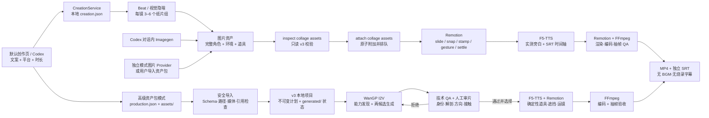

# Architecture

## 产品边界

Gen Video Tool 是 greenfield v3 本地视频生产系统。普通用户默认从一条文案创建本地 `creation.json` 任务；需要逐镜控制时进入高级生产项目，其唯一项目契约仍是根目录的 `production.json`。两条路径都没有旧格式读取或迁移逻辑。

架构遵循 [`CONTINUITY_CHARTER.md`](CONTINUITY_CHARTER.md)：

1. 一个镜头必须有可解释的连续视觉变化，不是静态图片切换；
2. 方向、支撑、接触和相机所有权必须在生成前结构化声明；
3. 默认纸片模式由编辑器拥有完整角色纸片、组装动作、遮挡、构图与最终影片；仅显式写实模式把连续表演交给 T2V/I2V；
4. 模型失败、候选未选择、旁白未完成时禁止静默降级；
5. 源资产、模型、候选、旁白、字幕和交付文件默认留在本机。

## 高层数据流



默认创作路径先由 `gen_video_create_from_script` 通过 `CreationService` 保存受限文案与平台设置，状态为 `awaiting-assets`，不会启动 Wan。随后 Codex Imagegen、独立图片 Provider 或用户导入生成只含 `layered-collage` 的 v3 资产包；`gen_video_inspect_collage_assets` 对照 creation 时长做只读校验，`gen_video_attach_collage_assets` 原子附加并排队后续任务。生产计划把文案压成 narration-aligned beat 和视觉隐喻，每个 beat 只有完整角色与 3–6 个透明纸片组。默认视觉 profile 是强纯色纸场、黑白半调主体、奶油色描边和少量彩纸点色；`scripts/stylize-paper-cutout.ts` 可在不改变 alpha、尺寸和轮廓的前提下把完整 PNG 统一成半调纸纹。F5-TTS 提供实测旁白时间，Remotion 从空纸场按错峰 `slide`、`snap`、`stamp` 组装，角色可再做一次有限的量化整卡 `bob/sway/gesture/exit`，最后 `settle`；FFmpeg 完成编码与抽帧 QA。纸片组只做刚体仿射变换；人物或动物必须是一张完整 PNG，禁止永久漂移和循环 idle。

localhost 服务不能调用 Codex 内置 Imagegen，也不持有 ChatGPT 凭据。在 Codex 对话中，由 Codex 调用 Imagegen、保存本地素材并导入资产包；独立运行必须配置图片 Provider 或由用户导入资产包。没有图片来源时，任务停在资产阶段并返回可行动错误，不能静默切换到 Wan 或占位图。WanGP 只作为显式写实模式的连续表演 Provider，或在合适时生成无人物背景底板，不再是默认视觉链路。

浏览器制作台不是模型代理，也不持有 ChatGPT 凭据。它只绑定 `127.0.0.1`，默认展示文案创作、真实任务进度与本地成片；作品卡可以在刷新后重新打开完成、失败或运行中任务。高级设置只提供运行状态与入口，完整候选审片仍属于 Electron/v3 高级工作流。自然语言决策留在 Codex Skill；模型推理、媒体文件与交付结果留在本机。

## 单一 v3 契约

`packages/video-generation/src/production/production-plan.ts` 定义 `ProductionPlan`。核心字段包括：

```text
schemaVersion: 3
projectId / metadata / networkPolicy: offline-only
requiredCapabilities
delivery
narration
shots[]
```

交付契约是精确值，而不是提示性元数据：

```text
1080 × 1920 / square pixels
30 fps / exact durationFrames
H.264 / yuv420p
local PCM WAV -> AAC 48 kHz mux
sidecar SRT / burnIn: false
bgm: null
```

当前有两种镜头，默认选择由视觉意图决定：

- `layered-collage`：默认纸片模式。完整角色、环境、道具和前景作为 3–6 个刚体组确定性组装；
- `generated-performance`：显式写实模式。人物或动物的自然连续表演可由本地 WanGP T2V/I2V 生成。

纸片组装不能冒充自然关节表演；写实连续动作缺少有效视频候选时仍必须失败。反过来，默认纸片模式也不能因为缺少图片资产而自动切换成 Wan 视频。

## 源资产与生成状态

项目数据被故意分为不可变输入与可变工作区：

```text
project-root/
├── production.json                  immutable source contract
├── assets/                          portable source inputs
│   ├── keyframes/
│   ├── props/
│   ├── mattes/
│   └── voice-reference.wav
└── generated/                       desktop-owned mutable outputs
    ├── production-state.json
    ├── provider/
    ├── video/
    ├── review-history/
    ├── audio/
    ├── cache/
    └── final/
```

`production.json` 可以原子重写，但不能被运行时任务偷偷修改。`generated/production-state.json` 保存任务、候选哈希、技术 QA、人工选择和旁白状态。启动恢复只会把此前活动中的任务标记为明确中断，不会伪造完成。

源资产包禁止包含 `generated/`。`packages/asset-pack` 在原子提交前验证：

- 唯一根 `production.json`，最多允许一层下载包装目录；
- ZIP 数量、大小、压缩比、路径穿越、符号链接和名称碰撞；
- 所有首帧/尾帧、拼贴图层、确定性道具、局部 matte 和 F5 参考音频引用；
- 关键帧必须匹配 WanGP 原生生成尺寸，而不是误用交付尺寸；
- 透明道具、人物/前景图层和 matte 必须带 Alpha；
- 任意缺失、损坏或越界引用都会阻止导入。

## 镜头世界契约

每个 `generated-performance` 镜头在调用模型前声明：

```text
subject / supporting actors / target / support surface
normalized action axis: subject -> target
ordered milestones: setup -> anticipation -> plant -> contact/release -> follow-through -> end
facing constraints
support constraints
contact constraints
deterministic prop ownership
one editorial camera operation
```

校验器会阻止零方向轴、倒序里程碑、越界帧、未知角色/支撑面/道具、重复 ID、触发点与接触帧不一致，以及把确定性道具同时留在随机生成画面中的双重所有权。

在含因果道具的镜头中，人物表演底片不拥有道具轨迹。支撑、动作方向和接触里程碑属于世界契约；道具在接触前锁定，接触后由确定性轨迹逐帧求值。这样不会依赖随机模型猜测“道具什么时候才应该动”。

## 运动与画面所有权

| 内容 | 唯一所有者 | 说明 |
| --- | --- | --- |
| 默认纸片人物/动物 | Remotion `layered-collage` | 一张完整 PNG；刚体组装 + 一次有限整卡动作，禁止拆肢、网格形变和永久漂移 |
| 写实人体姿态、重心、衣物、头发、表情 | 可选 WanGP `generated-performance` | 仅显式写实模式需要连续视频先验 |
| 球、杯子等因果道具及轨迹 | Remotion 确定性交互层 | 接触前后必须逐帧可验证 |
| 接触/释放时刻 | v3 世界契约 | 不由随机生成结果决定 |
| 人物与道具前后遮挡 | matte/foreground layer | 缺少必要遮挡时禁止交付 |
| 推、拉、摇、移 | `editorial-camera` | 默认 I2V 锁镜，合成后只运镜一次 |
| 标题、图表、UI、静态拼贴 | Remotion | 确定性、可编辑、可复现 |
| 旁白与外挂字幕 | F5-TTS + Render Service | 字幕不烧录，BGM 永远为空 |

同一个对象不能有两个运动所有者；同一个镜头也不能同时由生成模型和 Remotion 推近。

## 可选 WanGP Provider

WanGP 不属于默认纸片链路。只有用户明确选择写实连续视频，或需要生成不含人物的背景底板时，生产计划才请求该 Provider；默认纸片角色的动作始终由确定性 Remotion 组装拥有。

`packages/video-generation` 暴露后端中立的 preset、请求、任务、候选和错误类型。WanGP 适配器只通过官方 MCP 工作：

- MCP stdio：桌面端可启动 `wgp.py --mcp --mcp-transport stdio`；
- MCP Streamable HTTP：连接用户已经启动的本机端点；
- Transport 本身只接受 `localhost`、`127.0.0.1` 或 `::1`，并拒绝带凭据或非 HTTP(S) 地址；
- stdio 强制 Hugging Face、Transformers、Datasets 与 W&B 离线模式，缺权重时失败而不是下载；
- 不存在 Gradio 抓取或私有 REST 兼容模式。

Provider 调用模型列表、metadata、availability、defaults 和 schema 来发现真实能力，并单独用 WanGP Python 环境验证 PyTorch CUDA kernel。能看到 `nvidia-smi` 不等于模型环境可运行。

真实本地证据已经覆盖 MCP stdio、Fun InP 1.3B，以及 `morning-light-v3` 的两轮双候选生成。最终接受候选是 480×832、24 fps、81 帧的连续拉窗帘表演；另一候选因把横向拉动变成向上抬帘而被人工拒绝。技术成功与内容通过因此保持为两道独立门禁。

生成条件是判别联合：

```text
start-only: complete startKeyframePath
start-end:  complete startKeyframePath + distinct complete endKeyframePath
```

只有模型 schema 明确支持尾帧时才发送 `SE`；否则提交前失败。每个镜头恰好声明两枚不同 seed，默认串行生成。Provider 复制输入到 ASCII-safe staging、等待真实任务、复制非空视频、再通过媒体探测后才登记候选。

生成分辨率/时间基准与交付契约分离，例如本地模型可以生成 480×832、24 fps、81 帧，再以保持时长的方式适配 1080×1920、30 fps。不能把交付帧号错误当成模型原始帧号。

## 技术 QA 与人工选择

候选经历两道不同门禁：

1. 技术 QA：文件存在、可解码、尺寸、帧率、帧数、编码和音轨符合候选契约；
2. 人工 QA：身份、解剖、动作方向、脚底/手部支撑、接触时序、遮挡、连续性和镜头稳定性。

自动检查不能宣称理解动作的情绪或物理真实性。桌面端只允许选择技术 QA 明确为 `passed` 的候选，人工拒绝原因以结构化记录保留。生成本身永不自动选择。

## F5-TTS 与字幕

`packages/local-tts` 负责发现本机 F5-TTS、以参数数组启动进程、检查 WAV 并返回可审计结果。v3 旁白流程：

1. 所有生成镜头先完成候选选择；
2. 用 `referenceAudioPath` 和 `referenceText` 逐段克隆；
3. 检查每段 PCM WAV，按顺序合并；
4. 旁白不得超过视频时间线，尾部不足使用静音补齐；
5. 写入 `generated/audio/narration.wav` 和逐段时间信息；
6. 由同一时间信息生成独立 SRT。

本机 F5-TTS 的真实 WAV 合成已验证。`morning-light-v3` 旁白有效语音 2.912 秒，按 3.366667 秒时间线补齐尾部静音，并生成独立 SRT；最终桌面预览可完整播放、回零和 seek。

## Remotion 与交付

默认纸片模式的合成顺序固定为：

```text
empty paper field
-> 3–6 complete rigid groups in explicit z-order
-> staggered slide / snap / stamp
-> optional finite whole-card bob / sway / gesture / exit
-> exact settle and final hold
-> foreground occlusion and restrained paper shadow
-> optional single editorial camera transform after assembly
-> measured F5-TTS narration
-> FFmpeg H.264/AAC mux and frame inspection
```

显式写实模式保留原合成顺序：

```text
selected generated performance plate
-> deterministic prop/background layers
-> local matte or explicit foreground occlusion
-> editorial graphics
-> one editorial camera transform
-> local narration
-> FFmpeg H.264/AAC mux and frame inspection
```

最终视频不烧录字幕、不添加 BGM。字幕作为独立 `.srt` 交付。纸片模式缺少图片资产/Provider、透明完整角色、必要遮挡或旁白状态时，Render Service 必须返回可行动错误；写实模式缺少被选择候选、必要 matte 或旁白状态时同样失败。两种模式都不能回退到静态首帧。

## Desktop 与信任边界

Electron Renderer 不拥有 Node、任意文件系统或 shell 权限。受限 preload 只暴露导入、Provider 探测、生成、状态、选择、旁白和导出所需的窄 IPC。

桌面流程是：

```text
资产导入 -> 本地生成 -> 候选审片 -> 旁白 -> 合成导出
```

生产状态机按资产、Provider、审片、旁白和渲染门禁逐级解锁；调用方必须展示真实阻塞原因，不得用占位结果跨过门禁。macOS/Linux 保持 Renderer sandbox；部分 Windows 主机无法从已有受限令牌再创建 Chromium Renderer 令牌，因此 Windows 仅关闭 Renderer OS sandbox，同时继续强制无 Node integration、context isolation、web security、仅本地/回环 Renderer、主 frame IPC 来源校验、导航拦截和严格 CSP。桌面与自动化使用同一产品启动配置，不靠测试参数绕过错误。

桌面启动、Renderer 退出和加载失败会写入 `userData/logs/desktop.log` 的轮转 JSONL 诊断；日志不记录 IPC 参数、原始环境 URL 或令牌。根目录与 workspace 构建统一写入唯一的 `out/`，桌面快捷方式也只启动该入口，避免旧构建被单实例锁重新聚焦。

所有外部进程使用 executable + argument array 和 `shell: false`；用户中文、空格或 shell 元字符路径仅作为参数数据。写入优先采用同目录临时文件和原子 rename。

## Codex 插件与 localhost 制作台

`.codex-plugin/plugin.json` 把两个生产 Skill 和 `.mcp.json` 打包为一个插件。`scripts/start-codex-plugin.mjs` 在需要时准备依赖，生成高熵临时会话令牌，启动浏览器服务与 stdio MCP，并在 MCP 退出时回收子进程。

`apps/codex-studio` 分为四层：

- `CreationService`：保存受限文案、平台、时长与交付约束；新 creation 先处于 `awaiting-assets`，只有 collage pack 通过 inspect 并成功 attach 后才排队 F5-TTS 与渲染；
- `ProjectService`：复用资产包导入器与 v3 状态读取，只允许项目根和输出根内的媒体路径；
- `StudioJobRunner`：串行执行可恢复长任务，持久化任务、日志与结果，阻止等价任务重复排队，重启时把遗留运行态标记为中断；
- HTTP/MCP adapters：浏览器 API 受 Bearer/查询会话令牌与同源校验保护；20 个 MCP 工具覆盖 creation 创建/查询/重试、collage 资产 inspect/attach、高级项目、资产包、检测、生成、审片、旁白、渲染和任务控制。

localhost 制作台不具备 Codex Imagegen 权限，也不模拟 Codex/ChatGPT 环境。创建请求必须经过图片来源门禁；缺少独立图片 Provider 或已导入资产包时返回明确阻塞状态。完成、失败和运行中的持久任务可以在刷新后恢复查看。高级 v3 路径中的候选不会自动选择：技术 QA 通过后，用户仍须在 Electron 审片界面明确接受或记录拒绝原因。

## 包边界

```text
apps/desktop                 Electron 主进程、preload、React 编辑器
apps/codex-studio            localhost 制作台、持久任务队列与 MCP server
packages/video-generation    v3 契约、生产状态、Provider、MCP、任务与 QA
packages/asset-pack          v3-only 安全导入、媒体校验、原子提交
packages/frame-interpolation 可选 RIFE 交付补帧；拒绝覆盖已有输出
packages/local-tts           F5-TTS 本地进程、WAV 校验与合并
packages/motion-core         确定性物理、纸片组装与编辑动效求值
packages/remotion-engine     纸片组装、视频、道具、遮挡、图形和单一运镜合成
packages/render-service      旁白/视频交付编排、SRT 与 FFmpeg QA
skills/create-gen-video-asset-pack
                             Web ChatGPT 源资产包工作流
skills/gen-video-studio      Codex 对话式本地生产编排
examples/morning-light-v3    当前 greenfield v3 验收样片
```

v3 产品接口仅由上述包边界和 `production.json` 契约定义。新功能直接演进 v3 契约，不增加旧版本兼容分支。
