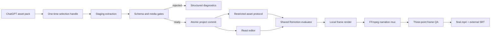

# Architecture

## Data flow

## Trust boundaries

The Electron renderer runs with `contextIsolation`, sandboxing, web security, and no Node integration. The preload exposes only typed project operations. Asset sources stay in the main process behind random one-time handles. Project and asset IDs are resolved against registered roots; arbitrary host paths are not accepted from the renderer.

ZIP and directory sources share the same staging validator. The validator rejects traversal, drive/UNC/absolute paths, invalid/reserved segments, case or Unicode collisions, unsafe symlinks, encrypted ZIP entries, excessive counts/sizes/ratios, corrupt JSON/media, invalid references, incompatible actor assets, invalid SRT, and unusable narration.

## Determinism

Motion recipes compile to frame-addressed events. Preview and render both use `ProjectVideo`, `ShotScene`, `PaperLayer`, and `PaperActor`. There is no separate CSS mock evaluator in the Electron path.

Camera motion is sampled per layer using normalized depth. Background, subject, prop, foreground, and title roles therefore do not share one poster transform. Title depth is clamped to preserve readability.

## Actor modes

Rigid Actor renders one complete image and applies root motion. Pose Cut resolves exactly one complete pose at a frame; transitions are cover grammar, not interpolation. Mesh Puppet fails closed when a renderable mesh result is absent. The Godot worker currently validates request/result protocol and returns planned/unsupported status instead of fabricating rig quality.

## Export lifecycle

The main process creates a Remotion cancel signal and forwards true phase/progress events to the UI. The render service stages a runtime copy, renders muted picture frames, muxes narration with FFmpeg, copies SRT without burning it, extracts start/middle/end frames, and removes runtime staging in `finally`.

## Persistence

Committed project JSON is parsed before every save. Shot JSON and manifest writes use same-directory temporary files. Example projects are registered read-only. User projects live under Electron `userData/projects`; deletion checks that the resolved target remains inside that root.
