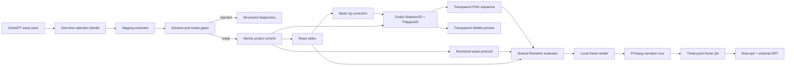

# Architecture

## Data flow

## Trust boundaries

The Electron renderer runs with `contextIsolation`, sandboxing, web security, and no Node integration. The preload exposes only typed project operations. Asset sources stay in the main process behind random one-time handles. Project and asset IDs are resolved against registered roots; arbitrary host paths are not accepted from the renderer.

ZIP and directory sources share the same staging validator. The validator rejects traversal, drive/UNC/absolute paths, invalid/reserved segments, case or Unicode collisions, unsafe symlinks, encrypted ZIP entries, excessive counts/sizes/ratios, corrupt JSON/media, invalid references, incompatible actor assets, invalid SRT, and unusable narration.

## Determinism

Motion recipes compile to frame-addressed events. Preview and render both use `ProjectVideo`, `ShotScene`, `PaperLayer`, and `PaperActor`. There is no separate CSS mock evaluator in the Electron path.

Camera motion is sampled per layer using normalized depth. Background, subject, prop, foreground, and title roles therefore do not share one poster transform. Title depth is clamped to preserve readability.

## Actor modes

Rigid Actor renders one complete image and applies root motion. Pose Cut resolves exactly one complete pose at a frame; transitions are cover grammar, not interpolation. Mesh Puppet reads one complete texture and a validated rig, builds a real Godot `Skeleton2D + Bone2D + Polygon2D` continuous mesh, then generates transparent frames before Remotion composition. Export fails closed when the Worker or renderable result is absent. The desktop preview may show the intact source PNG while editing, but labels that state and routes motion inspection to the transparent Worker preview.

## Motion Worker boundary

Renderer 只能提交项目 ID、镜头 ID、人物 ID、动作模板、幅度和经过 schema 校验的 rig 数据。主进程从注册项目根目录解析人物纹理与 rig 路径，生成临时请求文件，再以参数数组启动 Godot；不拼接 shell 命令。透明预览通过 `gen-video-motion://` 受限协议读取，token 只映射到本次输出目录。

Godot 输出支持透明 PNG 序列、VP9 Alpha WebM 和 ProRes 4444 MOV。最终导出使用 PNG 序列以保持 Remotion 的逐帧确定性；桌面动作检查使用短 WebM 循环。

## Phase 4 services

- 自动绑定：`sharp` 扫描完整人物 Alpha 边界，生成可编辑的人形首稿骨骼、规则网格、三角形与归一化权重；不把启发式结果冒充最终绑定。
- RIFE：独立进程客户端只接受绝对可执行路径和不同的输入/输出目录，验证输入与输出帧数；运行时需提供本地 `rife-ncnn-vulkan`。
- 批量导出：顺序执行同一 render service，并为每个项目记录成功、失败、成片路径和总报告。
- 模板目录：catalog 与 pack 均为纯 JSON，经过 schema 与根目录包含检查后安装到用户目录，不执行模板代码。

## Export lifecycle

The main process creates a Remotion cancel signal and forwards true phase/progress events to the UI. The render service stages a runtime copy, renders muted picture frames, muxes narration with FFmpeg, copies SRT without burning it, extracts start/middle/end frames, and removes runtime staging in `finally`.

## Persistence

Committed project JSON is parsed before every save. Shot JSON and manifest writes use same-directory temporary files. Example projects are registered read-only. User projects live under Electron `userData/projects`; deletion checks that the resolved target remains inside that root.
